# 02 - Physical Server Build

## Overview

This phase of the project involved assembling the physical server that would host the Proxmox VE virtualization environment.

The server was built from individual hardware components rather than using a prebuilt system. This provided hands-on experience with hardware installation, component compatibility, system assembly, power connections, cooling, and troubleshooting.

The completed system was designed to provide enough CPU, memory, and storage resources to support multiple virtual machines for Windows Server, Linux, networking, and infrastructure labs.

---

## Hardware Specifications

| Component     | Specification                  |
| ------------- | ------------------------------ |
| Processor     | AMD Ryzen 7 5700X              |
| CPU Resources | 8 Cores / 16 Threads           |
| Motherboard   | MSI MAG B550 Tomahawk ATX      |
| Memory        | 32 GB DDR4                     |
| Storage       | Kingston NV3 1 TB NVMe M.2 SSD |
| CPU Cooler    | be quiet! Pure Rock 3          |
| Graphics      | AMD RX 550                     |
| Power Supply  | 650W Gold-rated PSU            |
| Case          | Airflow-focused ATX Mid-Tower  |
| Hypervisor    | Proxmox VE                     |

---

## Component Selection

### Processor

The server uses an **AMD Ryzen 7 5700X** with 8 cores and 16 threads.

The processor was selected to provide enough processing capacity to run multiple virtual machines and services simultaneously.

This allows CPU resources to be distributed across several guest operating systems while still maintaining resources for the Proxmox host.

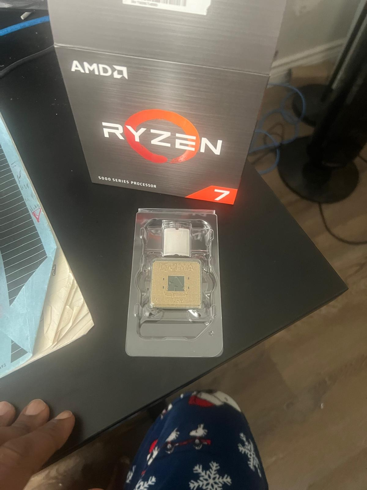

*AMD Ryzen 7 5700X selected as the processor for the virtualization server.*

### Memory

The system was configured with **32 GB of DDR4 RAM**.

Virtual machines require dedicated portions of the host's available memory, so sufficient RAM was important for allowing several Windows and Linux systems to operate simultaneously.

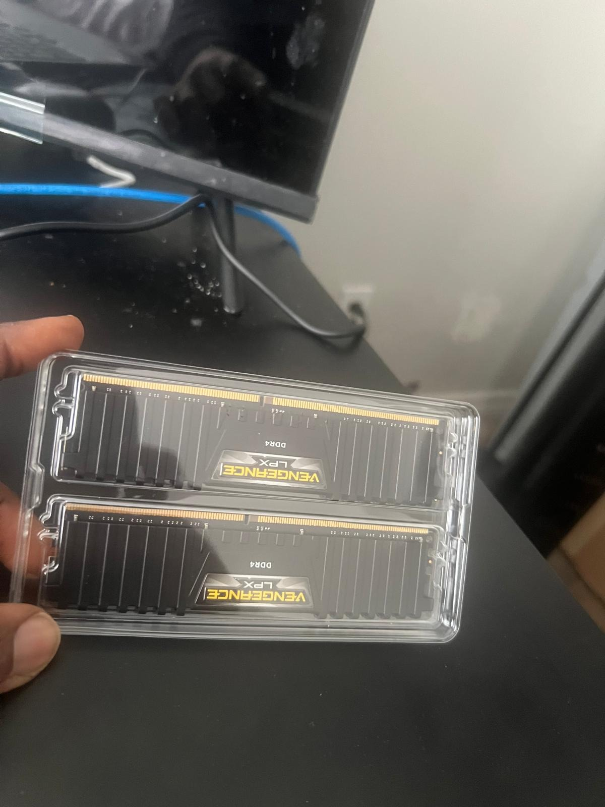

*DDR4 memory selected to provide sufficient capacity for multiple virtual machines.*

### Storage

A **Kingston NV3 1 TB NVMe M.2 SSD** was installed as the primary storage device.

The NVMe drive provides storage for:

* Proxmox VE
* Virtual machine disks
* ISO images
* Templates
* Lab resources

Using NVMe storage also provides faster disk performance than traditional hard drives and SATA-based storage.

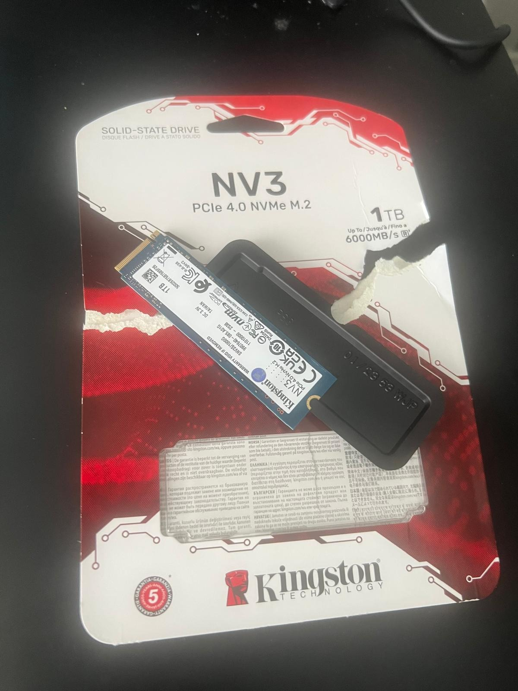

*Kingston NV3 1 TB NVMe M.2 SSD used as the server's primary storage device.*

### Graphics

An **AMD RX 550** was installed as the server's dedicated graphics adapter.

The Ryzen 7 5700X does not provide integrated graphics, so the dedicated GPU provides local video output for:

* BIOS access
* Initial system configuration
* Troubleshooting
* Direct console access

The virtualization workloads themselves are not GPU-intensive, so a basic dedicated graphics adapter is sufficient.

### Cooling

A **be quiet! Pure Rock 3** aftermarket air cooler was installed to cool the Ryzen 7 5700X.

The cooler is rated for up to 190W TDP and provides sufficient cooling capacity for the processor.

Reliable cooling is particularly important because the server may operate for extended periods while running several virtualized workloads.

---

## Server Assembly

### Step 1 - Preparing the Motherboard

The motherboard was prepared outside the case before installation.

Installing the main components while the motherboard was accessible made it easier to work with the CPU socket, memory slots, M.2 storage slot, and CPU cooler mounting hardware.

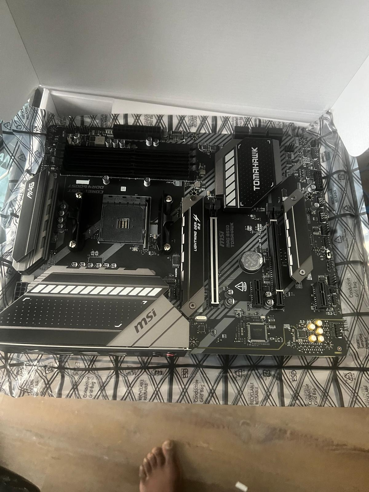

*MSI MAG B550 Tomahawk motherboard prepared for installation of the server components.*

---

### Step 2 - Installing the CPU

The **AMD Ryzen 7 5700X** was installed into the motherboard's AM4 CPU socket.

The processor alignment indicator was matched with the corresponding marker on the socket before the CPU was carefully lowered into position.

The socket retention mechanism was then secured.

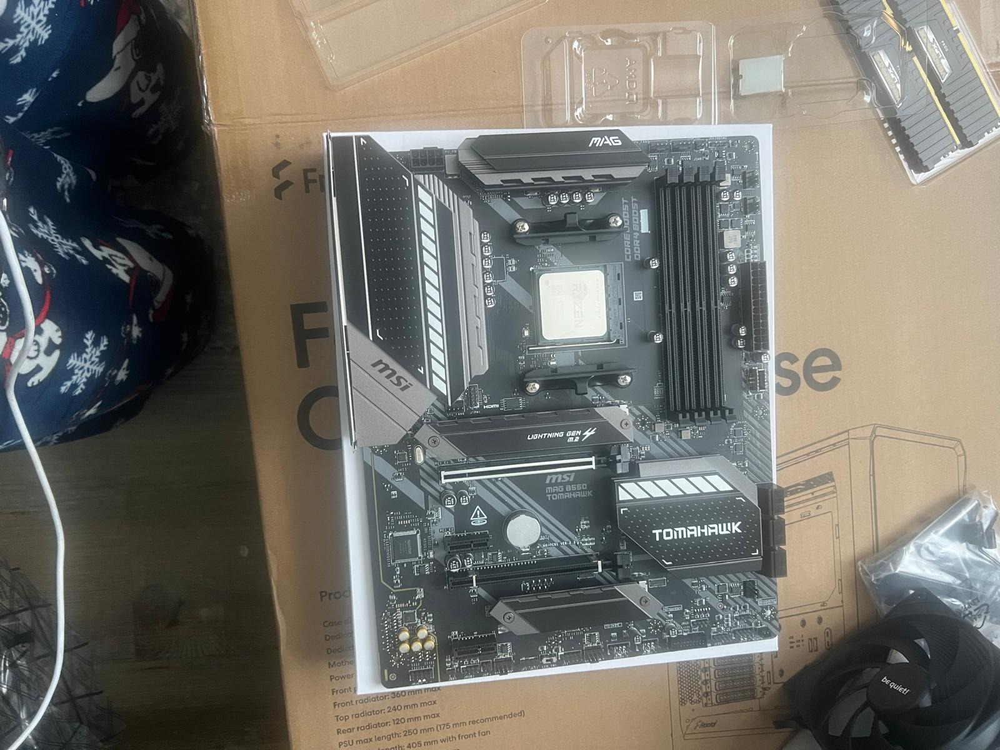

*AMD Ryzen 7 5700X installed in the motherboard's AM4 socket.*

This established the primary processing component of the server and prepared the motherboard for the remaining hardware.

---

### Step 3 - Installing the NVMe SSD

The **1 TB Kingston NV3 NVMe M.2 SSD** was installed into the motherboard's M.2 storage slot.

The drive serves as the primary storage device for the Proxmox host and the virtual machines that will be deployed later in the project.

---

### Step 4 - Installing the Memory

The server was configured with **32 GB of DDR4 RAM**.

The memory modules were installed into the appropriate motherboard DIMM slots and secured in place.

The installed memory provides the capacity required to allocate RAM to multiple virtual machines while retaining resources for the Proxmox host.

---

### Step 5 - Installing the CPU Cooler

The **be quiet! Pure Rock 3** air cooler was installed using the appropriate AM4 mounting hardware.

The cooler was positioned to ensure proper contact between the heatsink and processor and was securely mounted to the motherboard.

The cooler fan was then connected to the appropriate CPU fan header.

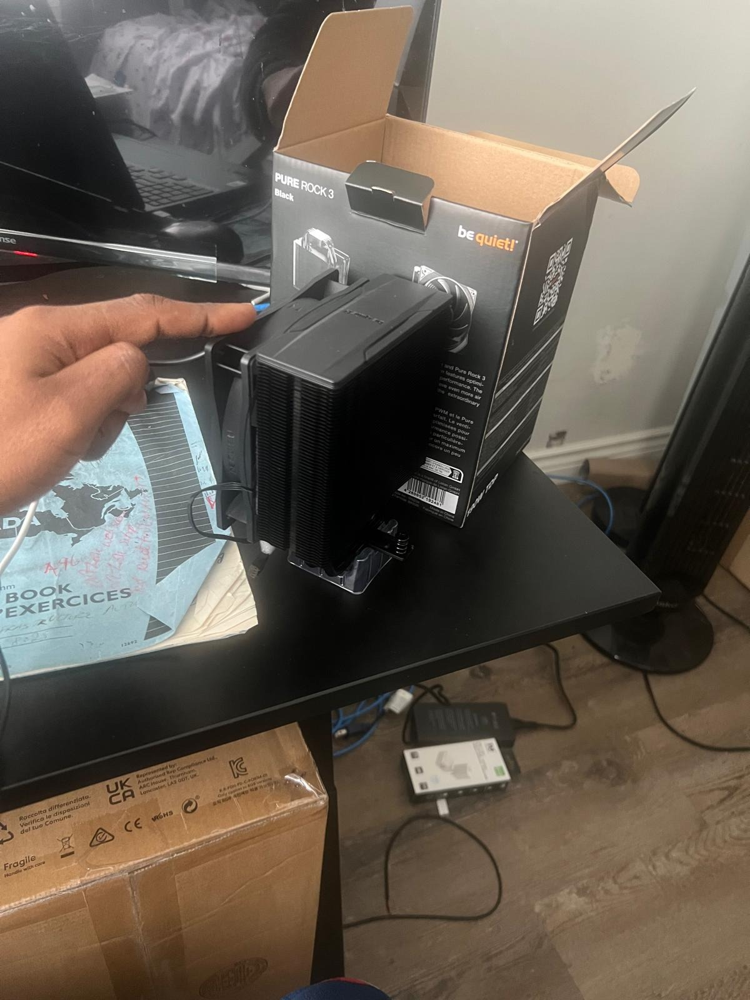

*be quiet! Pure Rock 3 CPU cooler installed on the Ryzen 7 5700X.*

This provides the cooling required to maintain stable processor temperatures during extended virtualization workloads.

---

### Step 6 - Preparing the Case

The ATX mid-tower case was prepared for installation of the assembled motherboard and other hardware components.

The case provides the physical structure for the server while supporting airflow around the CPU cooler, GPU, motherboard, and power supply.

---

### Step 7 - Mounting the Motherboard

After the CPU, NVMe SSD, RAM, and CPU cooler had been installed, the assembled motherboard was carefully positioned inside the case.

The motherboard was aligned with the case standoffs and rear I/O area before being secured with the appropriate screws.

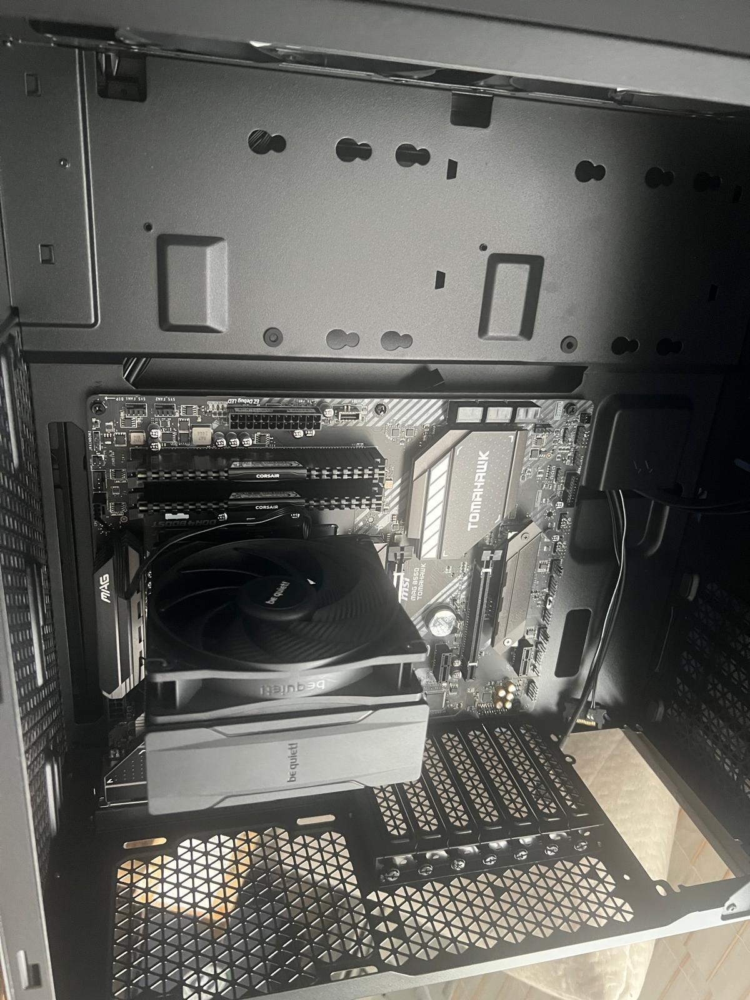

*Assembled motherboard mounted and secured inside the ATX server case.*

Installing the major motherboard components before mounting the board inside the case provided easier access during assembly.

---

### Step 8 - Installing the Power Supply

The **650W Gold-rated power supply** was installed to provide power to the server components.

The required motherboard and CPU power connections were connected as part of the system assembly.

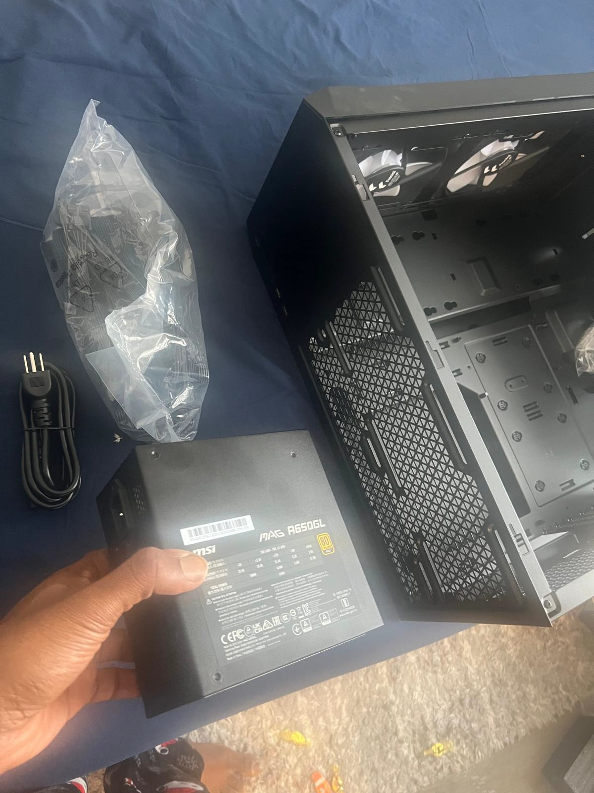

*Power supply connections and internal cabling completed during server assembly.*

The PSU provides sufficient capacity for the current server hardware while allowing room for future expansion.

---

### Step 9 - Installing the GPU

The **AMD RX 550** graphics card was installed into the motherboard's PCIe slot.

Because the Ryzen 7 5700X does not contain integrated graphics, the RX 550 provides the video output required for local system access.

This is particularly useful during initial configuration and troubleshooting when direct access to the server is required.

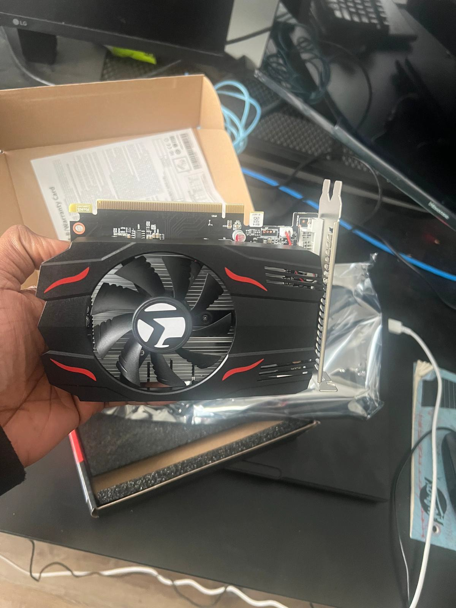

*AMD RX 550 installed to provide local display output for the server.*

---

### Step 10 - Final Hardware Assembly

After the major components were installed, the remaining power and case connections were completed.

The completed physical system contained:

* Ryzen 7 5700X processor
* 32 GB DDR4 RAM
* 1 TB NVMe storage
* B550 motherboard
* Pure Rock 3 CPU cooler
* AMD RX 550 graphics card
* 650W Gold-rated power supply

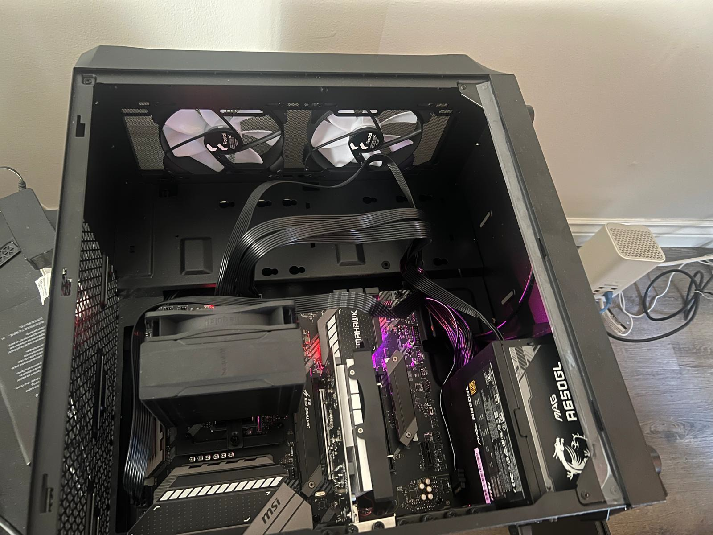

*Completed physical server after installation of the major internal components.*

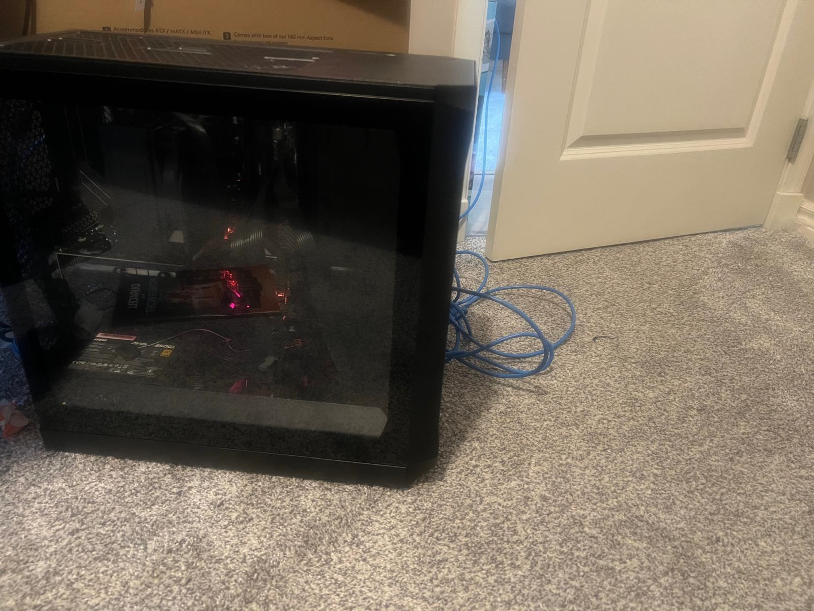

*Additional view of the completed virtualization server hardware.*

At this point, the physical server was ready for initial startup and operating system installation.

---

## Build Considerations

Several hardware decisions were directly related to the server's intended virtualization role.

**CPU capacity:**
The 8-core / 16-thread Ryzen processor provides resources that can be distributed between multiple virtual machines.

**Memory capacity:**
32 GB of RAM allows several guest operating systems to run concurrently.

**Fast storage:**
NVMe storage provides fast access for VM disks, operating systems, ISO images, and templates.

**Dedicated graphics:**
The RX 550 provides local display output because the Ryzen 7 5700X does not include integrated graphics.

**Cooling:**
The aftermarket CPU cooler supports stable operation during extended virtualization workloads.

**Expansion:**
The ATX motherboard provides PCIe expansion capability for future hardware such as additional network interfaces or storage controllers.

---

## Skills Demonstrated

This phase of the project provided hands-on experience with:

* PC and server hardware assembly
* CPU installation
* AM4 platform hardware
* DDR4 memory installation
* NVMe M.2 storage installation
* CPU cooling installation
* Motherboard installation
* PCIe expansion cards
* Power supply installation
* Internal power connections
* Hardware compatibility
* Server component selection
* Physical infrastructure troubleshooting

---

## Result

The physical virtualization server was successfully assembled and prepared for the next stage of the project.

The completed hardware platform provides the CPU, memory, storage, cooling, graphics, and expansion capacity required to support the planned Proxmox-based lab environment.

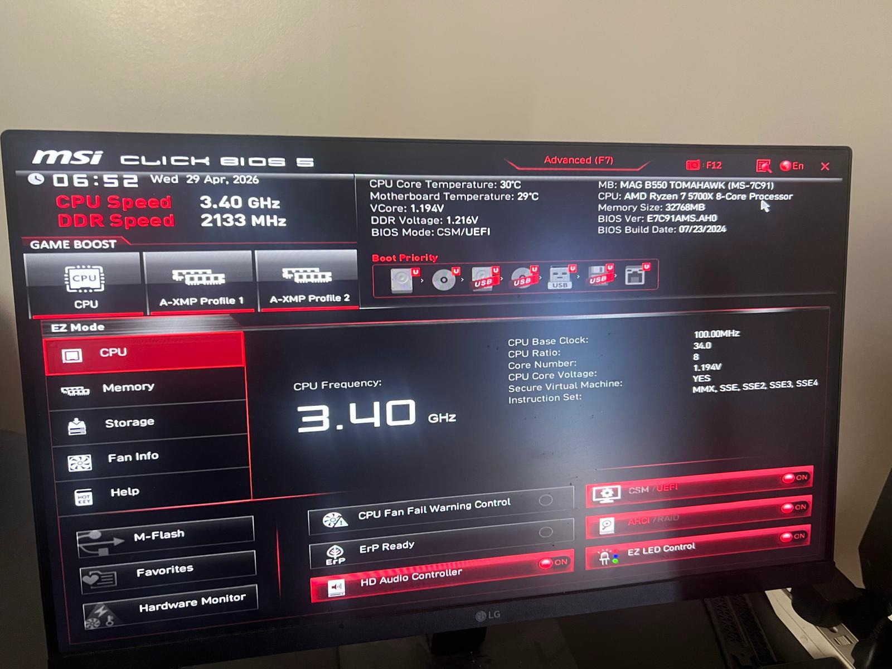

*Completed physical server ready for Proxmox VE installation and virtualization workloads.*

The next phase involved installing **Proxmox VE** and configuring the server as a Type-1 hypervisor.

---

## Next Step

[Continue to 03 - Proxmox Installation](../03-proxmox-installation/)

[Back to Main Project](../)
