# Chapter 3 – Proxmox VE Installation and Initial Configuration

## Overview

This phase of the Enterprise Home Lab project focused on installing and configuring Proxmox Virtual Environment (Proxmox VE) as the bare-metal hypervisor for the physical server.

Proxmox VE provides the virtualization platform that will host the virtual machines and services used throughout the lab, including Windows Server, Active Directory Domain Services, DNS, DHCP, Windows client systems, Linux servers, and other infrastructure services.

The installation process included creating bootable installation media, installing Proxmox VE on the physical server, configuring the management network, accessing the web management interface, verifying network connectivity, and reviewing the repository configuration.

---

## 1. Creating the Proxmox Installation Media

The Proxmox VE ISO image was prepared on a USB drive using Rufus.

The USB drive was configured as bootable installation media, allowing the physical server to boot directly into the Proxmox VE installer.

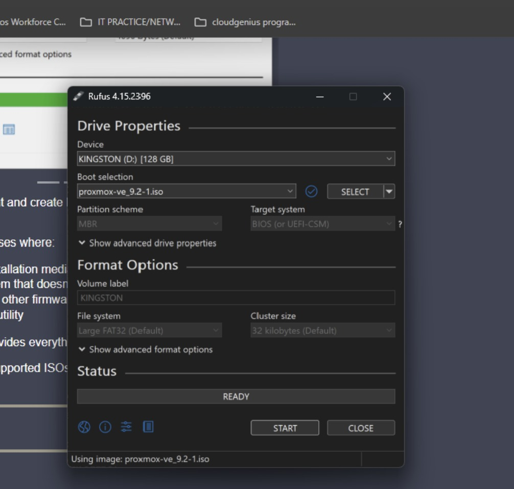

This provided the installation media required to deploy Proxmox directly onto the physical server.

---

## 2. Starting the Proxmox VE Installer

After preparing the bootable USB drive, the server was configured to boot from the installation media.

The Proxmox VE graphical installer was then launched.

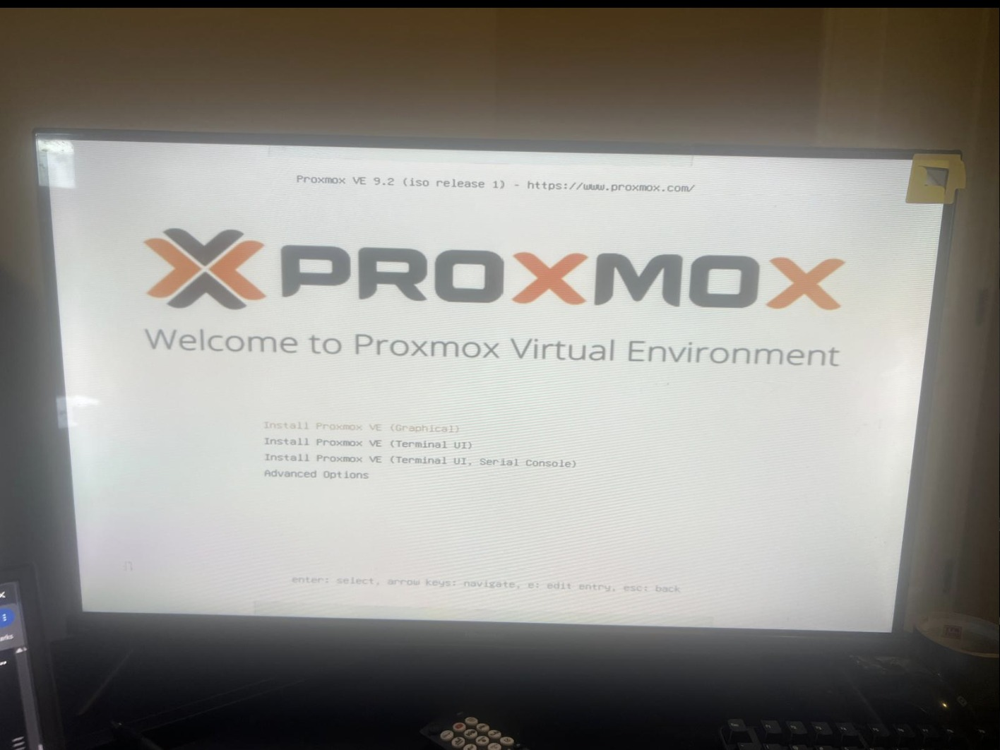

This started the bare-metal installation of the virtualization platform.

---

## 3. Selecting the Installation Target

The server's NVMe SSD was selected as the installation target for Proxmox VE.

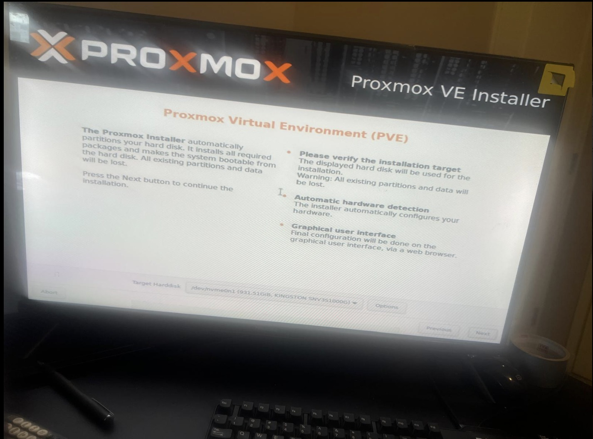

Installing Proxmox directly on the physical server allows the hypervisor to manage the server's compute, memory, storage, and networking resources.

These resources can then be allocated to virtual machines according to the requirements of the lab environment.

---

## 4. Configuring Location and Time Zone

During installation, the appropriate geographic location, time zone, and keyboard configuration were selected.

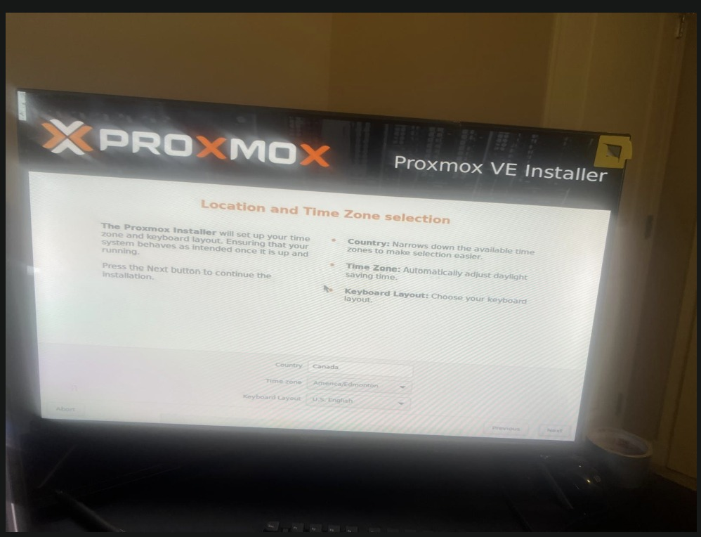

Correct time configuration is particularly important in server environments because authentication, event logs, scheduled tasks, monitoring, and eventually Active Directory all depend on accurate system time.

---

## 5. Identifying the Existing Network Configuration

Before finalizing the Proxmox management network configuration, the existing network information was reviewed from another system on the local network.

This helped identify the addressing scheme being used within the environment.

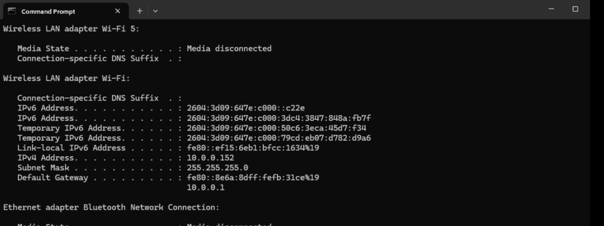

Understanding the existing subnet, gateway, and addressing structure was necessary before assigning the Proxmox host its management address.

---

## 6. Configuring the Proxmox Management Network

The Proxmox host was configured with its management network information during installation.

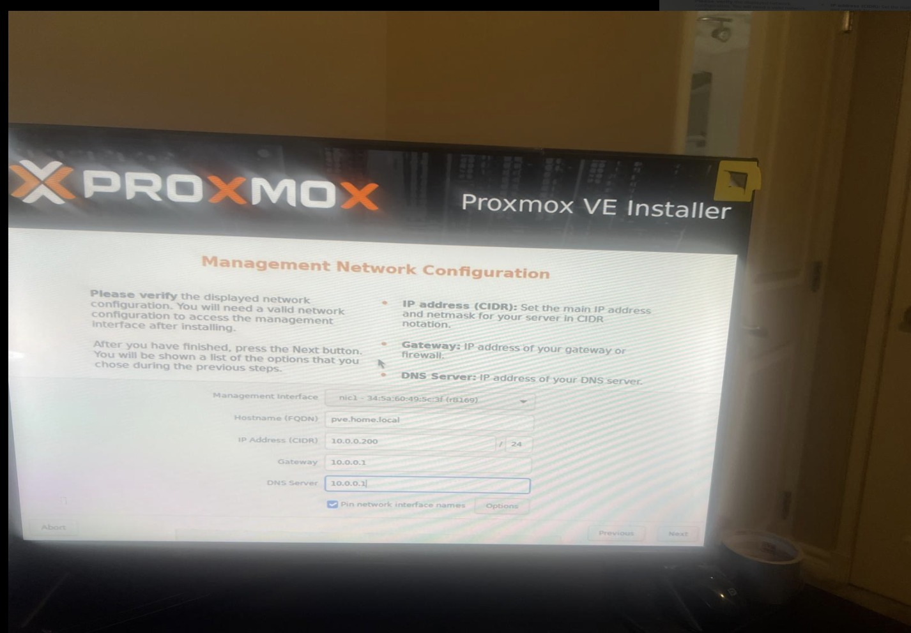

A management IP address provides a consistent location from which the Proxmox web interface can be accessed.

The management interface will later be used to perform tasks such as:

- Creating and managing virtual machines
- Allocating CPU, memory, and storage
- Configuring virtual networking
- Uploading operating system ISO images
- Managing VM snapshots
- Configuring backups
- Monitoring server resources
- Managing virtual disks and storage
- Troubleshooting virtual infrastructure

This management network therefore becomes a critical component of the lab environment.

---

## 7. Reviewing the Installation Configuration

Before beginning the installation, the configuration summary was reviewed to verify the selected installation disk, location settings, and network configuration.

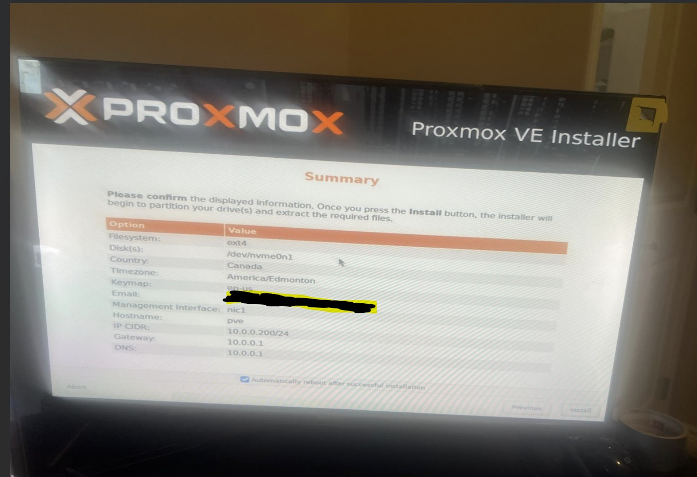

Reviewing the configuration before deployment reduces the likelihood of installing the hypervisor using incorrect storage or networking settings.

---

## 8. Completing the Installation and First Boot

After installation completed successfully, the physical server was rebooted and Proxmox VE started from the installed NVMe drive.

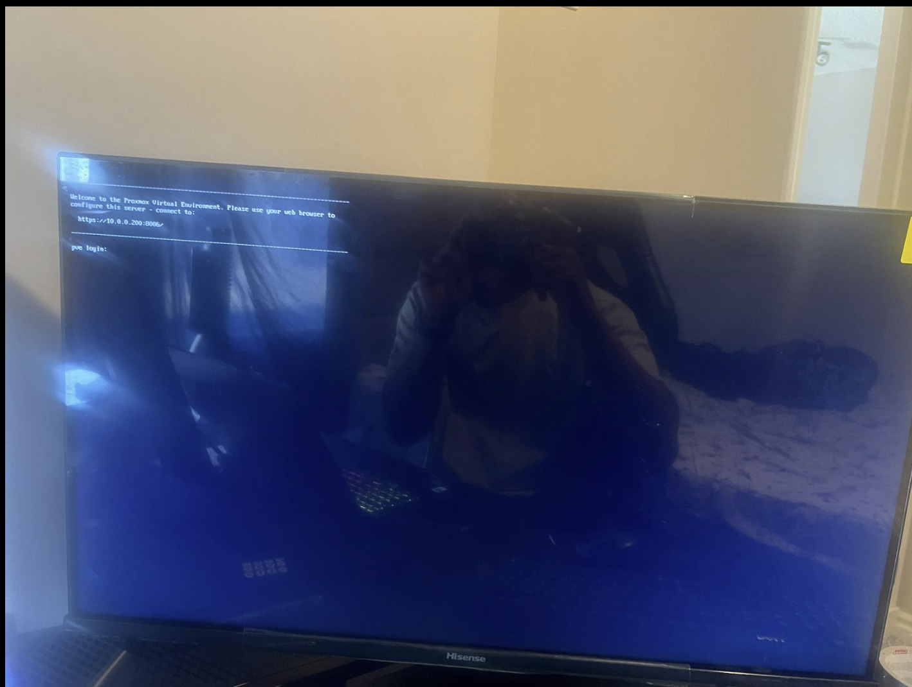

The console displayed the management address required to access the Proxmox web interface from another computer on the network.

This confirmed that the hypervisor had successfully booted and that the management interface was available.

---

## 9. Accessing the Proxmox Web Interface

From another computer on the same network, the Proxmox management interface was accessed through a web browser.

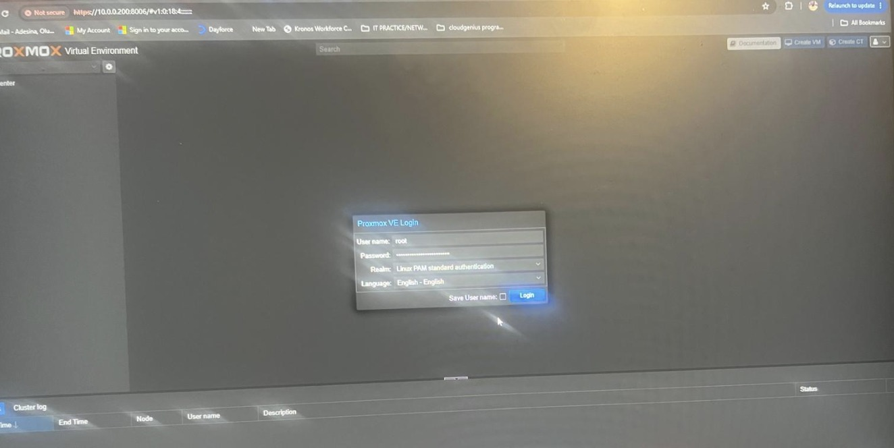

The web interface provides centralized administration of the Proxmox host and the virtual infrastructure running on it.

Accessing the management interface from another device also confirmed that the host was reachable across the local network.

---

## 10. Verifying the Proxmox Dashboard

After authentication, the Proxmox VE management dashboard was successfully loaded.

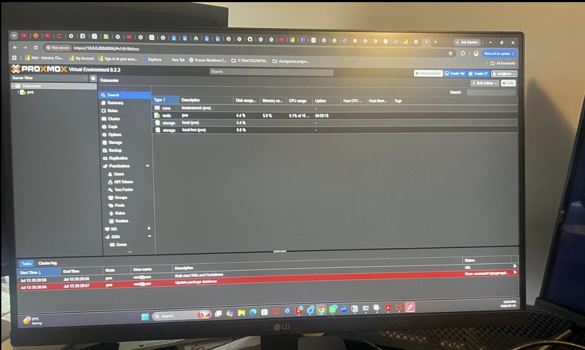

The dashboard provides visibility into the physical host and its resources, including:

- CPU utilization
- Memory utilization
- Storage
- Network interfaces
- Virtual machines
- Containers
- System status
- Tasks and logs

At this point, the physical server had successfully transitioned from newly assembled hardware into a functioning virtualization host.

---

## 11. Testing Network Connectivity

Network connectivity tests were performed to verify that the Proxmox host could communicate with other devices and reach external network resources.

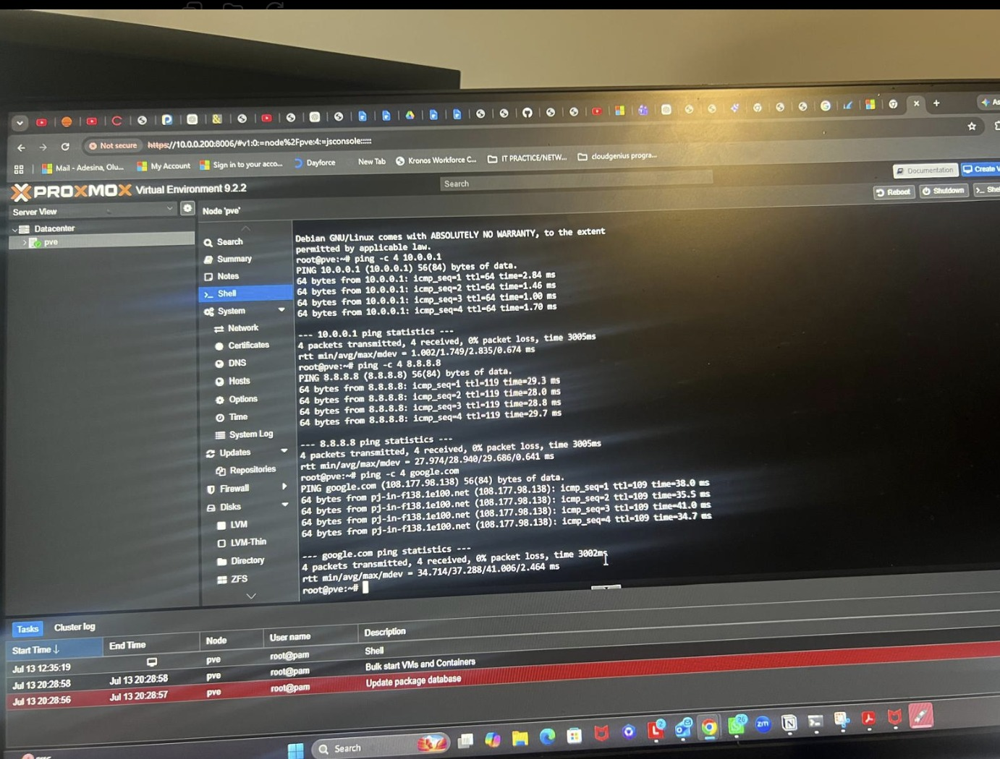

Successful connectivity testing helped confirm that the host's network interface, IP configuration, default gateway, and external connectivity were functioning correctly.

Network connectivity is essential because the Proxmox host will eventually support multiple virtual machines and infrastructure services that depend on reliable communication.

---

## 12. Reviewing Proxmox Repositories

The Proxmox repository configuration was reviewed as part of the initial host setup.

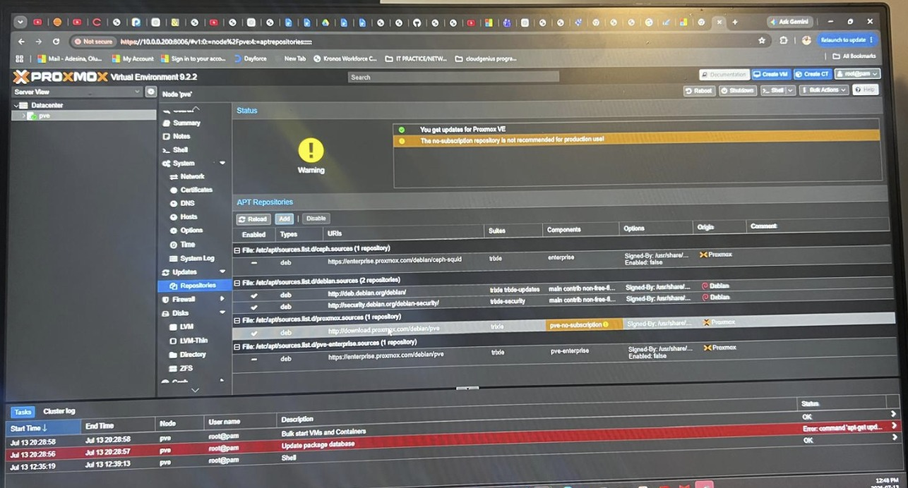

Repository configuration determines where the Proxmox host retrieves software packages and system updates.

Understanding repository management is important for maintaining the virtualization host and keeping installed packages current.

---

## 13. Result

At the end of this phase, the physical server had been successfully configured as a Proxmox VE virtualization host.

The following objectives were completed:

- Created bootable Proxmox VE installation media
- Installed Proxmox VE on the physical server
- Selected the NVMe SSD as the installation target
- Configured regional and time settings
- Reviewed the existing local network configuration
- Configured the Proxmox management network
- Completed the first successful hypervisor boot
- Accessed the Proxmox management interface remotely
- Verified the Proxmox dashboard
- Tested network connectivity
- Reviewed the host repository configuration

The server was now ready to host the virtual infrastructure required for the next stages of the Enterprise Home Lab.

---

## Skills Demonstrated

This phase of the project demonstrates hands-on experience with:

- Type-1 hypervisor deployment
- Proxmox VE
- Bare-metal server installation
- Bootable installation media
- Server storage configuration
- TCP/IP networking
- Static management addressing
- Default gateway configuration
- Network troubleshooting
- Remote web-based server administration
- Virtualization infrastructure
- Linux-based hypervisor administration
- Repository and package management
- Infrastructure documentation

---

## Next Step

The next phase of the project focuses on deploying the first Windows Server virtual machine on Proxmox.

The Windows Server environment will eventually be used to implement enterprise infrastructure services including:

- Active Directory Domain Services
- DNS
- DHCP
- Group Policy
- User and computer management
- Windows client domain integration

Continue to:

**[Chapter 4 – Windows Server Deployment](../04-windows-server-deployment/README.md)**

---

[← Previous: Chapter 2 – Physical Server Build](../02-server-build/README.md) | [Back to Main Project](../README.md)